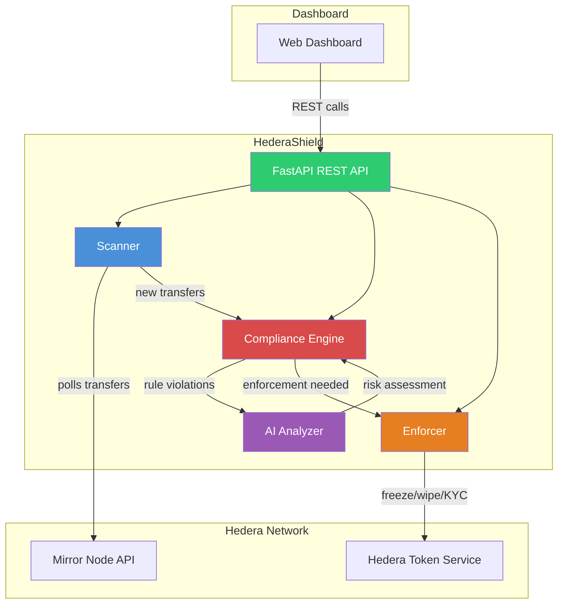

# HederaShield

**AI-powered on-chain compliance agent for Hedera Token Service**

HederaShield monitors HTS token transfers in real-time, detects compliance violations using configurable rules and AI-powered analysis, and can automatically enforce actions like freezing accounts or revoking KYC status.

Built for the [Hedera Apex Hackathon](https://hedera.com).

---

## Architecture



### Module Overview

| Module | Purpose |
|--------|---------|
| **Scanner** | Polls Hedera Mirror Node for token transfers, parses transactions |
| **Compliance Engine** | Rule-based analysis: large transfers, velocity checks, sanctioned addresses |
| **AI Analyzer** | Claude-powered risk scoring and natural language transaction analysis |
| **Enforcer** | Executes HTS operations: freeze accounts, wipe tokens, revoke KYC |
| **REST API** | FastAPI dashboard backend with endpoints for alerts, rules, and enforcement |

---

## Quick Start

### Prerequisites

- Python 3.11+
- Hedera testnet account (for enforcement actions)
- Anthropic API key (for AI analysis)

### Installation

```bash
# Clone the repository
git clone https://github.com/your-org/hedera-shield.git
cd hedera-shield

# Create virtual environment
python -m venv venv
source venv/bin/activate

# Install dependencies
pip install -r requirements.txt
```

### Configuration

Create a `.env` file:

```env
HEDERA_SHIELD_HEDERA_NETWORK=testnet
HEDERA_SHIELD_HEDERA_OPERATOR_ID=0.0.YOUR_ACCOUNT
HEDERA_SHIELD_HEDERA_OPERATOR_KEY=your_private_key
HEDERA_SHIELD_ANTHROPIC_API_KEY=sk-ant-...
HEDERA_SHIELD_MONITORED_TOKEN_IDS=["0.0.TOKEN_ID"]
HEDERA_SHIELD_SANCTIONED_ADDRESSES=["0.0.BLOCKED_1","0.0.BLOCKED_2"]
HEDERA_SHIELD_LARGE_TRANSFER_THRESHOLD=10000
```

### Run the API

```bash
python -m hedera_shield.api
# or
uvicorn hedera_shield.api:app --reload
```

The API will be available at `http://localhost:8000`. Interactive docs at `/docs`.

### Run with Docker

```bash
docker build -t hedera-shield .
docker run -p 8000:8000 --env-file .env hedera-shield
```

---

## API Reference

### System

| Endpoint | Method | Description |
|----------|--------|-------------|
| `/health` | GET | Health check |
| `/status` | GET | System status, alert counts, uptime |

### Alerts

| Endpoint | Method | Description |
|----------|--------|-------------|
| `/alerts` | GET | List all alerts (query: `?unresolved_only=true`) |
| `/alerts/{id}/resolve` | POST | Mark an alert as resolved |

### Rules

| Endpoint | Method | Description |
|----------|--------|-------------|
| `/rules` | GET | List all compliance rules |
| `/rules` | POST | Add a new rule |
| `/rules/{id}` | DELETE | Remove a rule |

### Transactions & Enforcement

| Endpoint | Method | Description |
|----------|--------|-------------|
| `/transactions` | GET | Fetch recent transfers (query: `?token_id=0.0.XXX&limit=50`) |
| `/enforce` | POST | Execute enforcement action (freeze, wipe, kyc_revoke) |

### Example: Enforce a Freeze

```bash
curl -X POST http://localhost:8000/enforce \
  -H "Content-Type: application/json" \
  -d '{"action": "freeze", "token_id": "0.0.5555", "account_id": "0.0.1111"}'
```

---

## Compliance Rules

HederaShield ships with three built-in rules:

1. **Large Transfer Detection** -- Flags transfers exceeding a configurable threshold (default: 10,000 tokens)
2. **Velocity Check** -- Flags accounts making too many transfers in a time window (default: 50 transfers per hour)
3. **Sanctioned Address Matching** -- Flags any interaction with known sanctioned addresses (severity: CRITICAL)

Rules can be added, removed, and toggled via the `/rules` API endpoint.

---

## AI-Powered Analysis

When the Anthropic API key is configured, HederaShield uses Claude to perform deep analysis on flagged transactions:

- **Risk scoring** (0.0 to 1.0) with natural language reasoning
- **Pattern detection** across transaction histories
- **Enforcement recommendations** based on contextual analysis
- **Flag identification** for specific risk indicators

The AI analyzer is invoked after rule-based checks flag a transaction, providing a second layer of intelligent analysis.

---

## Testing

```bash
# Run all tests
pytest -v

# Run specific test suite
pytest tests/test_compliance.py -v
pytest tests/test_scanner.py -v
pytest tests/test_api.py -v
```

---

## Project Structure

```
hedera-shield/
  hedera_shield/
    __init__.py
    config.py          # Environment-based settings
    models.py          # Pydantic data models
    scanner.py         # Mirror node polling & transaction parsing
    compliance.py      # Rule engine with configurable thresholds
    enforcer.py        # HTS token operations (freeze, wipe, KYC)
    ai_analyzer.py     # Claude-powered risk analysis
    api.py             # FastAPI REST endpoints
  tests/
    test_scanner.py    # Scanner unit tests with mocked responses
    test_compliance.py # Rule engine tests
    test_api.py        # API endpoint tests
  demo/
    sample_alerts.json # Sample alert data for demos
  Dockerfile
  requirements.txt
  README.md
```

---

## License

MIT
